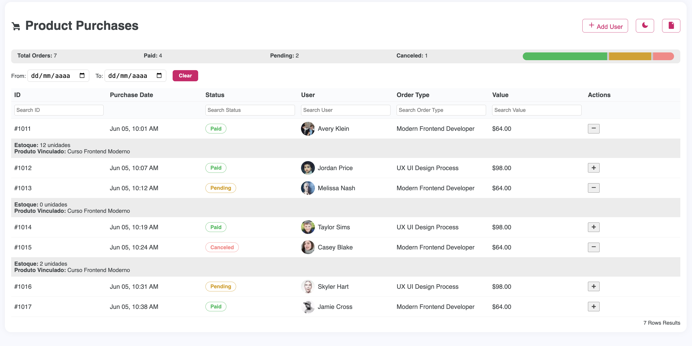
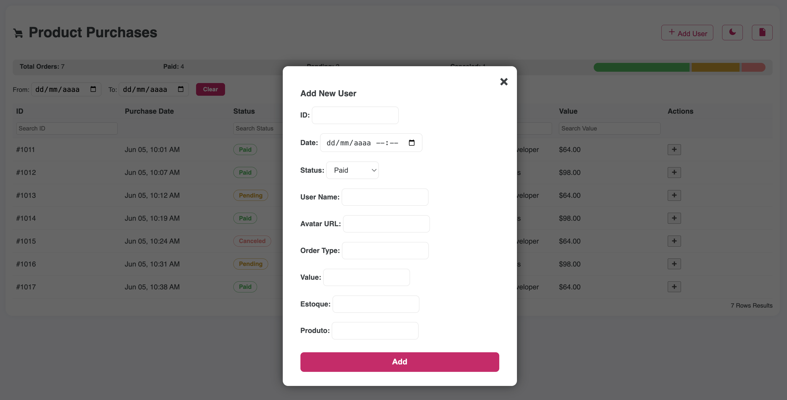
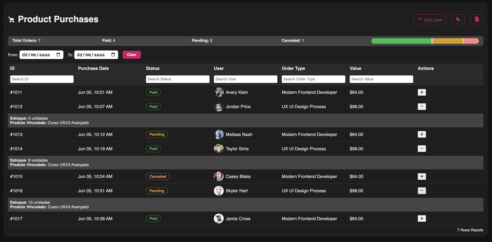
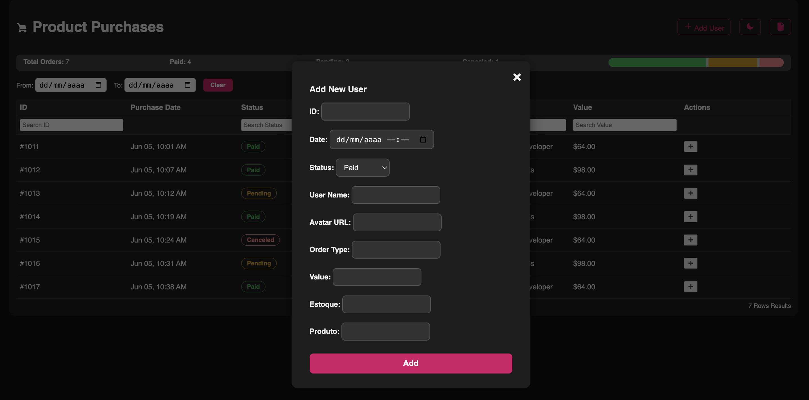

# 🧾 Product Purchases Dashboard

## 📌 Sobre o Projeto  
Painel moderno e responsivo para visualização e gestão de compras de produtos.  

Conta com filtros por colunas, status e datas, estatísticas resumidas, modo escuro, layout adaptável e interações otimizadas para facilitar o controle de pedidos e usuários em tempo real.
<br>

Interface clara, com filtros funcionais, edição inline, modo escuro elegante e modal animado para adicionar usuários, garantindo uma experiência visual moderna, eficiente e intuitiva.

<br>

## 🎯 Objetivos

- Facilitar o acompanhamento de pedidos com informações visuais organizadas.
- Permitir filtros por datas, status e outros critérios diretamente na tabela.
- Oferecer uma experiência moderna com dark mode, botões estilizados e animações suaves.
- Garantir responsividade total para uso em desktops e dispositivos móveis.
- Tornar o projeto 100% em HTML, CSS e JS puros, sem dependências externas.

<br>

## 🧩 Funcionalidades

- Filtros por ID, status, usuário, tipo de pedido e valor.
- Filtro por intervalo de datas com campo `from/to`.
- Modal centralizado para adicionar usuários.
- Botões estilizados com visual moderno e interativo.
- Dark mode com alternância instantânea.
- Cabeçalho fixo ao rolar a tabela.
- Layout responsivo com adaptação total ao tamanho da tela.
- Barra de progresso com resumo de status: pagos, pendentes e cancelados.
- Expansão de linhas para exibir mais detalhes.
- Edição inline de campos da tabela.
- Atualização automática dos dados (auto-refresh).

<br>

## 🔍 Exemplos Visuais

Exemplo do Painel de Compras:
<br>

<p align="left">
  
  
  
  
</p>

<br>

## 📁 Estrutura do Projeto

```
product-purchases-dashboard/
├── index.html         # Estrutura principal da interface
├── style.css          # Estilização completa do layout e dark mode
├── script.js          # Lógica dos filtros, modal, edição e animações
├── README.md          # Documentação do projeto
├── assets/            # Avatares e ícones utilizados
```

<br>

## 🚀 Como Usar

1. Clone o repositório:

```bash
git clone https://github.com/gischumacher3/product-purchases-dashboard.git
```

2. Abra o arquivo `index.html` no navegador.

3. Use os campos de filtro para pesquisar por status, usuários, pedidos ou datas.

4. Clique em “Add User” para abrir o modal e adicionar um novo registro.

5. Use o botão de modo escuro para alternar entre dark/light instantaneamente.

<br>

## 🎨 Personalização

- **Cores, fontes e animações** estão no `style.css`, podendo ser ajustadas conforme a identidade visual do seu projeto.
- As **interações, filtros e lógica do modal** podem ser customizadas no `script.js`.
- O layout e os campos podem ser modificados diretamente no `index.html`, mantendo a estrutura modular.

<br>

## 👩‍💻 Sobre a Autora

Feito com 💜 por **Giovana Nunes Schumacher** — desenvolvedora web e entusiasta de interfaces funcionais, limpas e acessíveis.

<br>

## 📬 Contato

- GitHub: [github.com/gischumacher3](https://github.com/gischumacher3)  
- LinkedIn: [linkedin.com/in/giovana-schumacher](https://linkedin.com/in/giovana-schumacher)
