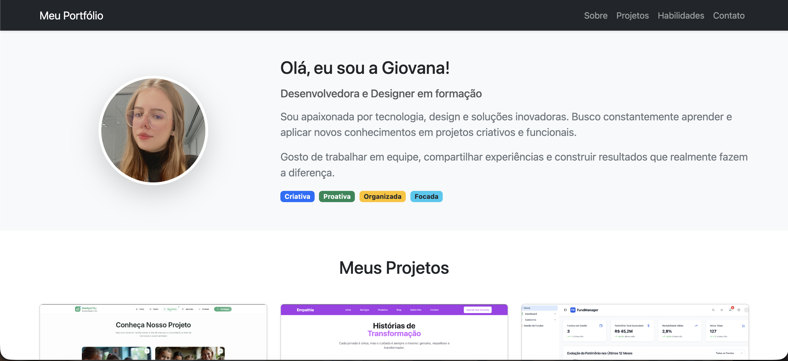
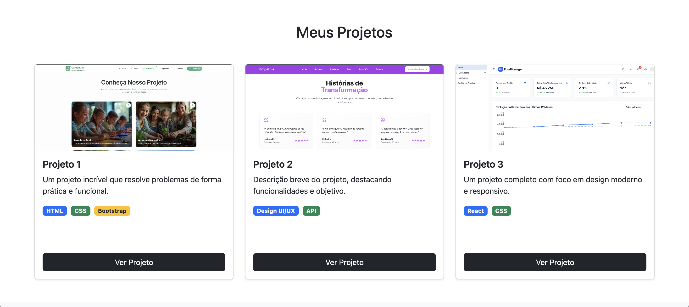
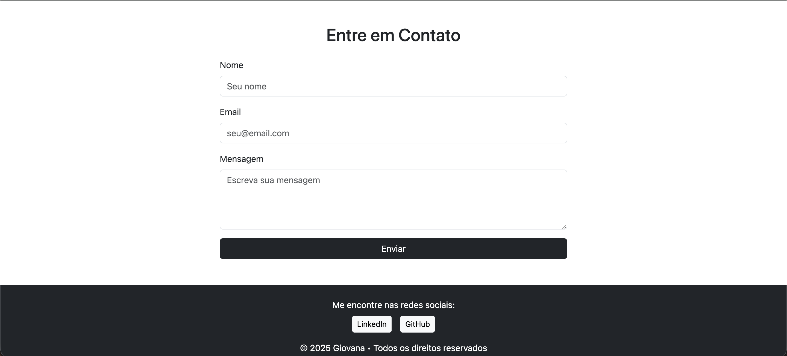

# 💼 Portfólio Responsivo com Bootstrap

## 📌 Sobre o Projeto

Portfólio pessoal desenvolvido com **Bootstrap**, com layout moderno, limpo e totalmente responsivo.  

A página apresenta minhas principais informações profissionais, reunindo em um único espaço as seções **Sobre Mim**, **Projetos**, **Habilidades** e **Contatos**, com foco em organização, usabilidade e boa experiência visual.

 

## 🎯 Objetivos

- Apresentar meu perfil profissional na seção **Sobre Mim**.  
- Exibir projetos desenvolvidos de forma clara e atrativa.  
- Destacar minhas **habilidades técnicas**.  
- Facilitar o contato profissional por meio da seção **Contatos**.  
- Aplicar responsividade utilizando o framework Bootstrap.  

 

## 🧩 Seções da Página

- **Sobre Mim**  
  Breve apresentação pessoal, objetivos e trajetória.

- **Projetos**  
  Cards responsivos com descrição dos projetos e tecnologias utilizadas.

- **Habilidades**  
  Organização das competências técnicas em grid responsivo.

- **Contatos**  
  Links para redes profissionais como GitHub e LinkedIn.

 

## 🔍 Exemplos Visuais

Exemplo do Painel de Compras:
 

  
  
  

 

## 📁 Estrutura do Projeto

portfolio-bootstrap

- index.html        # Estrutura principal da página  
- css/style.css     # Estilos personalizados  
- assets/           # Imagens e ícones  
- README.md         # Documentação do projeto  

 

## 🚀 Como Usar

1. Clone o repositório:

2. Abra o arquivo `index.html` no navegador.

3. Navegue pelas seções usando o menu da página.

 

## 🎨 Personalização

- Edite os textos das seções diretamente no `index.html`.  
- Adicione novos projetos duplicando os cards Bootstrap.  
- Atualize as habilidades conforme seu aprendizado evoluir.  
- Alterações visuais podem ser feitas no arquivo `style.css`.

 

## 👩‍💻 Sobre o Autor

Desenvolvido com 💜 por **Giovana Nunes Schumacher** — estudante de Sistemas de Informação, entusiasta de desenvolvimento web e design responsivo.

 

## 📬 Contato

- GitHub: https://github.com/gischumacher3  
- LinkedIn: https://linkedin.com/in/giovana-schumacher
