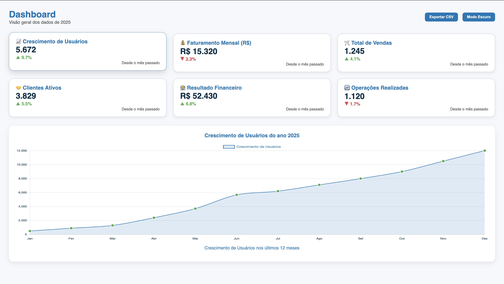

# 📊 Dashboard Interativo

## 📌 Sobre o Projeto

Dashboard interativo desenvolvido para apresentar indicadores chave de uma empresa com visual moderno, responsivo e modo claro/escuro. 

O projeto exibe cards informativos com dados resumidos e um gráfico de linha que mostra a evolução mensal ao longo de 12 meses, destacando variações com pontos coloridos (verde para aumento, vermelho para queda).

 

## 🎯 Objetivos

- Apresentar indicadores empresariais relevantes em cards retangulares e estilizados.  
- Visualizar a evolução mensal dos dados com gráfico de linha interativo.  
- Permitir troca dinâmica do gráfico ao clicar nos cards.  
- Suportar modo claro e escuro para melhor experiência visual.  
- Exportar dados apresentados para arquivo CSV.  
- Design responsivo para diferentes tamanhos de tela.

 

## 🧩 Funcionalidades

- 6 cards com indicadores empresariais (ex: Crescimento de Usuários, Faturamento, Vendas, Clientes Ativos, Desempenho Financeiro, Operações Realizadas).  
- Gráfico de linha com todos os 12 meses do ano, mostrando dados atualizados conforme card selecionado.  
- Pontos no gráfico coloridos em verde ou vermelho para indicar aumento ou queda em relação ao mês anterior.  
- Botões para exportar dados em CSV e alternar tema claro/escuro.  
- Layout organizado com títulos e subtítulos alinhados à esquerda, botões alinhados à direita.  
- Design minimalista e moderno com cores harmônicas.

 

## 🔍 Exemplos Visuais

  

  

 

## 📁 Estrutura do Projeto

dashboard-interativo

- index.html # Estrutura da página e cards
- style.css # Estilos, layout, responsividade e modo escuro
- script.js # Lógica JS para gráficos, interação e temas
- README.md # Documentação do projeto
- examples/ # Exemplos visuais (imagens e gifs)

 

## 🚀 Como Usar

1. Clone o repositório:
   `git clone https://github.com/gischumacher3/dashboard-interativo.git`

2. Abra `index.html` no navegador para visualizar o dashboard.

3. Clique nos cards para trocar os dados exibidos no gráfico.

4. Use o botão "Exportar Gráfico" para baixar os dados em CSV.

5. Use o botão "Modo Escuro" para alternar o tema visual.

 

## 🎨 Personalização

- As cores, labels e dados podem ser alterados facilmente no arquivo `script.js`, dentro do objeto `chartDataSets`.
- O CSS está organizado para facilitar ajustes no layout e cores, incluindo modo escuro.

 

## 👩‍💻 Sobre o Autor

Feito com 💜 por [Giovana Nunes Schumacher](https://github.com/gischumacher3) — desenvolvedora web e entusiasta de interfaces intuitivas e modernas.

 

## 📬 Contato

- GitHub: [github.com/gischumacher3](https://github.com/gischumacher3)
- LinkedIn: [linkedin.com/in/giovana-schumacher](https://linkedin.com/in/giovana-schumacher)
