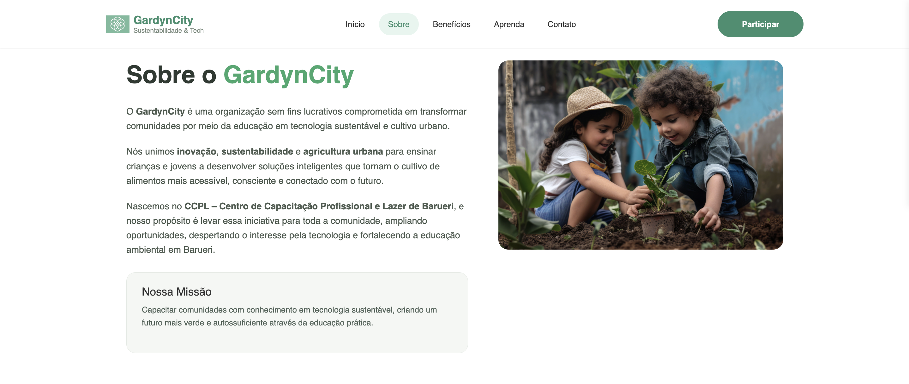
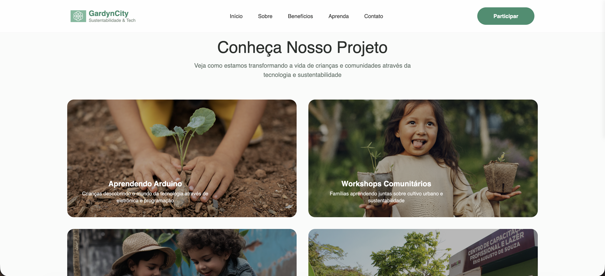

# 🌱 GardynCity

## 📌 Sobre o Projeto

O **GardynCity** é uma organização **sem fins lucrativos** comprometida em transformar comunidades por meio da **educação em tecnologia sustentável** e do **cultivo urbano**.

O projeto une **inovação, sustentabilidade e agricultura urbana** para ensinar crianças e jovens a desenvolver soluções inteligentes que tornam o cultivo de alimentos mais acessível, consciente e conectado com o futuro.

Nascemos no **CCPL – Centro de Capacitação Profissional e Lazer de Barueri**, com o propósito de expandir essa iniciativa para toda a comunidade, promovendo impacto social, educação ambiental e inclusão tecnológica.

 

## 🎯 Objetivos

- Incentivar a educação em **tecnologia sustentável**.  
- Promover o **cultivo urbano consciente** como ferramenta educacional.  
- Despertar o interesse de crianças e jovens pela **inovação e tecnologia**.  
- Fortalecer a **educação ambiental** nas comunidades locais.  
- Ampliar oportunidades de aprendizado e desenvolvimento em Barueri.

 

## 🧩 Áreas de Atuação

- **Educação Tecnológica**  
  Introdução à tecnologia aplicada à sustentabilidade e ao cultivo inteligente.

- **Sustentabilidade e Meio Ambiente**  
  Práticas conscientes voltadas ao cuidado ambiental e à produção de alimentos.

- **Agricultura Urbana**  
  Desenvolvimento de soluções acessíveis para o cultivo em espaços urbanos.

- **Impacto Social**  
  Formação de jovens mais conscientes, capacitados e preparados para o futuro.

 

## 🌍 Público-Alvo

- Crianças e jovens da comunidade  
- Estudantes interessados em tecnologia e sustentabilidade  
- Moradores de Barueri e região  

 

## 🌱 Nossa Origem

O GardynCity surgiu no **CCPL – Centro de Capacitação Profissional e Lazer de Barueri**, como uma iniciativa educacional voltada à transformação social por meio do conhecimento, da inovação e da consciência ambiental.

 

## 🚀 Nossa Missão

Transformar realidades através do ensino de tecnologia sustentável e do cultivo urbano, contribuindo para uma sociedade mais consciente, conectada e preparada para os desafios do futuro.

 

## 💚 Nossos Valores

- Sustentabilidade  
- Inovação  
- Educação  
- Inclusão Social  
- Consciência Ambiental  

 

## 🤝 Como Apoiar

- Participando das atividades e oficinas  
- Divulgando o projeto na comunidade  
- Apoio institucional e parcerias  
- Voluntariado  

 

## 🔍 Exemplos Visuais

  

  
  

  
 

 

 

## 📬 Contato

- 📍 Barueri – SP  
- 📧 E-mail: contato@gardyncity.org *(exemplo)*  
- 🌐 Redes sociais: em breve  

 

## 👩‍🌾 Sobre o GardynCity

O **GardynCity** acredita que a união entre **tecnologia e sustentabilidade** é a chave para transformar comunidades, educar novas gerações e construir um futuro mais verde, inteligente e inclusivo.
