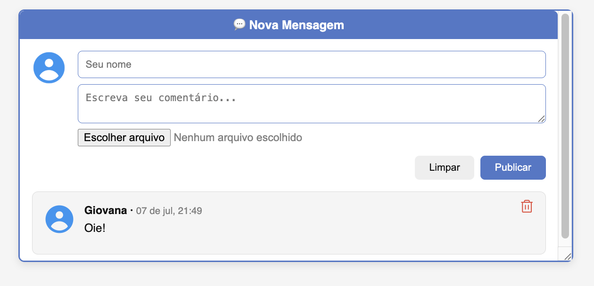
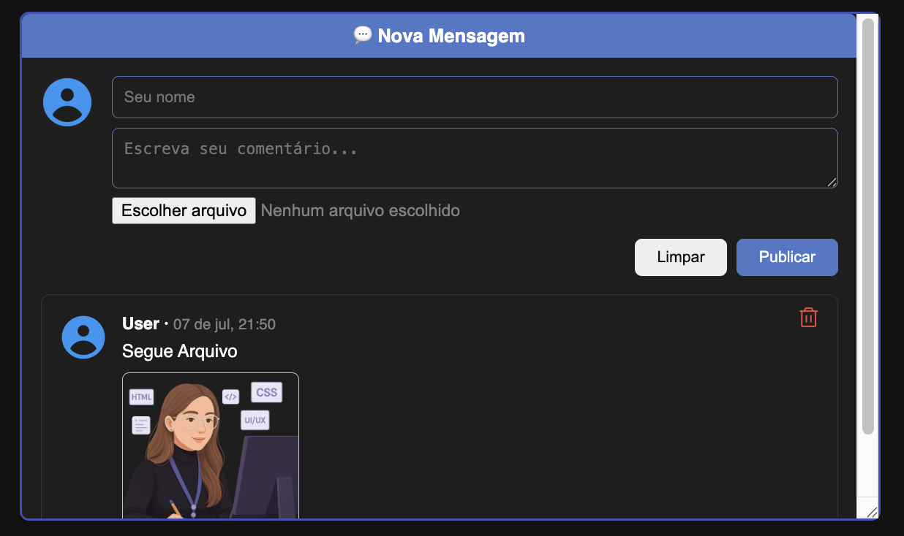

# 💬 Comment Box Component

## 📌 Sobre o Projeto

Componente moderno e responsivo para publicação de comentários, inspirado no visual das principais redes sociais.  

Conta com campos otimizados, avatar padrão, suporte a upload de imagens, modo escuro e layout adaptável para desktop e mobile.

Experiência visual leve, foco em usabilidade, feedback instantâneo e interface intuitiva — tudo em HTML, CSS e JS puro, sem frameworks.

<br>

## 🎯 Objetivos

- Facilitar a publicação e leitura de comentários em qualquer projeto web.
- Oferecer experiência visual limpa e acessível, com dark mode.
- Permitir customização do avatar, nome e anexos (imagens).
- Garantir responsividade total para uso em qualquer dispositivo.
- Manter o projeto 100% vanilla (HTML, CSS e JS), simples de integrar e personalizar.

<br>

## 🧩 Funcionalidades

- Campo para nome do usuário.
- Campo de texto para comentário (multilinha).
- Upload de imagens ou arquivos (opcional).
- Avatar padrão para cada comentário (pode ser customizado).
- Botão “Limpar” e “Publicar”.
- Modo escuro com alternância instantânea.
- Layout responsivo, adaptável a diferentes telas.
- Lista dinâmica de comentários publicados.
- Possibilidade de remover comentários.
- Feedback visual para cada ação do usuário.

<br>

## 🔍 Exemplos Visuais

<br>
<p align="left">
  
  
</p>

<br>

## 📁 Estrutura do Projeto

```
comment-box/
├── index.html          # Estrutura principal da interface
├── style.css           # Estilização completa, incluindo dark mode
├── script.js           # Lógica de comentários, temas e validação
├── images/             # Avatares e ícones utilizados
├── README.md           # Documentação do projeto
```

<br>

## 🚀 Como Usar

1. Clone o repositório:
   ```bash
   git clone https://github.com/gischumacher3/comment-box.git
   ```
2. Abra o arquivo `index.html` no navegador.
3. Preencha o nome, escreva seu comentário, (opcionalmente, adicione um arquivo/imagem) e clique em **Publicar**.
4. Use o botão de modo escuro para alternar entre dark/light instantaneamente.

<br>

## 🎨 Personalização

- **Cores e fontes** podem ser alteradas em `style.css`.
- **Lógica de interação** (validação, exclusão, upload) pode ser ajustada em `script.js`.
- **Estrutura e campos** podem ser modificados diretamente em `index.html` para se adequar ao seu projeto.

<br>

## 👩‍💻 Sobre a Autora

Feito com 💜 por Giovana Nunes Schumacher — desenvolvedora web e entusiasta de interfaces funcionais, limpas e acessíveis.

<br>

## 📬 Contato

- GitHub: [github.com/gischumacher3](https://github.com/gischumacher3)
- LinkedIn: [linkedin.com/in/giovana-schumacher](https://linkedin.com/in/giovana-schumacher)

