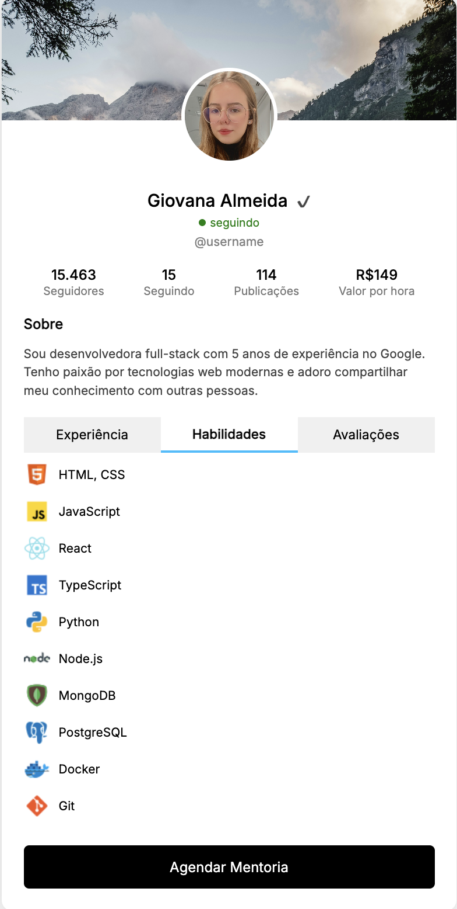

# 🧑‍💼 Mentor Profile Card

## 📌 Sobre o Projeto  
Cartão de perfil interativo para mentores e profissionais, com abas de **Experiência**, **Habilidades** e **Avaliações**.
<br>

Possui layout vertical moderno, visual elegante, conteúdo dinâmico por abas e foco na clareza e na apresentação pessoal ou profissional. 
<br>

Feito 100% com **HTML, CSS e JavaScript puros**, sem bibliotecas externas.

<br>

## 🎯 Objetivos

- Criar uma apresentação profissional e visual para perfis técnicos.
- Exibir experiências anteriores com ícones de empresas.
- Apresentar as habilidades de forma clara e organizada.
- Simular avaliações reais de clientes com depoimentos completos.
- Demonstrar navegação por abas com conteúdo dinâmico.
- Servir como base para componentes em projetos maiores ou portfolios pessoais.

<br>

## 🧩 Funcionalidades

- Layout moderno e responsivo (altura dinâmica conforme aba).
- Fonte Inter aplicada a toda a interface.
- Avatar e banner personalizados.
- Abas funcionais com JavaScript puro (Experiência, Skills, Avaliações).
- Lista de experiências com logos reais (Google, Apple, Shell, etc).
- Lista com 10 hard skills (HTML, JS, React, Python...).
- Avaliação completa simulando um depoimento real.
- Botão de agendamento de mentoria (estático).
- 100% HTML, CSS e JS — sem frameworks ou dependências.

<br>

## 🔍 Exemplos Visuais

Exemplo do Painel de Compras:
<br>

<p align="left">
  
  
  
</p>

<br>

## 📁 Estrutura do Projeto

```
mentor-profile-card/
├── index.html        # Estrutura principal do componente de perfil
├── style.css         # Estilização com layout responsivo e fonte Inter
├── script.js         # Lógica de alternância entre abas
├── README.md         # Documentação do projeto
```

<br>

## 🚀 Como Usar

Clone o repositório:

```bash
git clone https://github.com/seu-usuario/mentor-profile-card.git
```

Abra o arquivo `index.html` no seu navegador.

Navegue pelas abas “Experiência”, “Habilidades” e “Avaliações” para ver o conteúdo mudar dinamicamente.

<br>

## 🎨 Personalização

- A imagem de perfil pode ser alterada na tag `` no `index.html`.
- A fonte utilizada é a [Inter](https://fonts.google.com/specimen/Inter), importada via Google Fonts.
- Você pode trocar logos, textos e cores diretamente no `style.css` para se adequar à identidade visual do seu projeto.
- Adicione novas abas ou integre com APIs reais facilmente no futuro.

<br>

## 👩‍💻 Sobre a Autora

Feito com 💜 por Giovana Nunes Schumacher — desenvolvedora web e entusiasta de interfaces funcionais, limpas e acessíveis.

<br>

## 📬 Contato

GitHub: [github.com/gischumacher3](https://github.com/gischumacher3)  
LinkedIn: [linkedin.com/in/giovana-schumacher](https://linkedin.com/in/giovana-schumacher)
