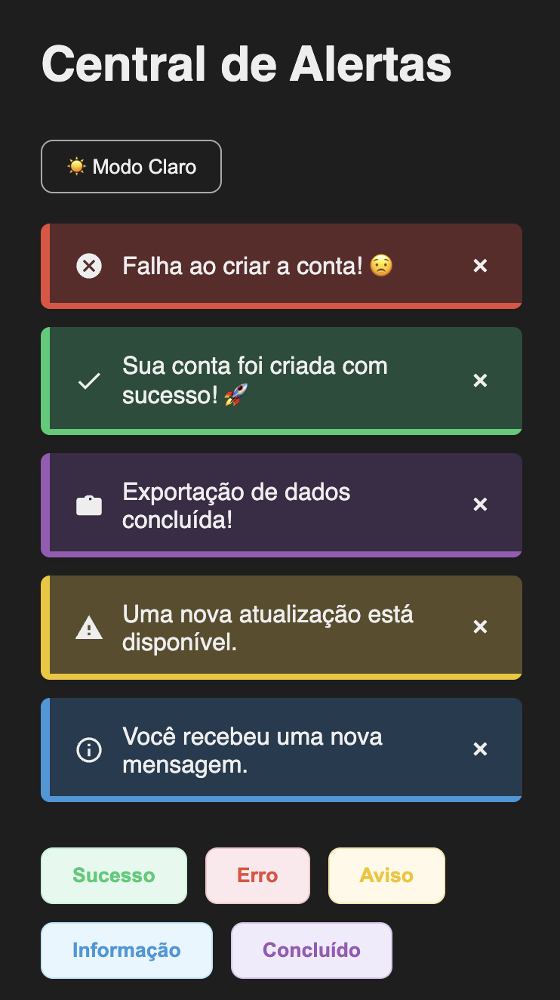
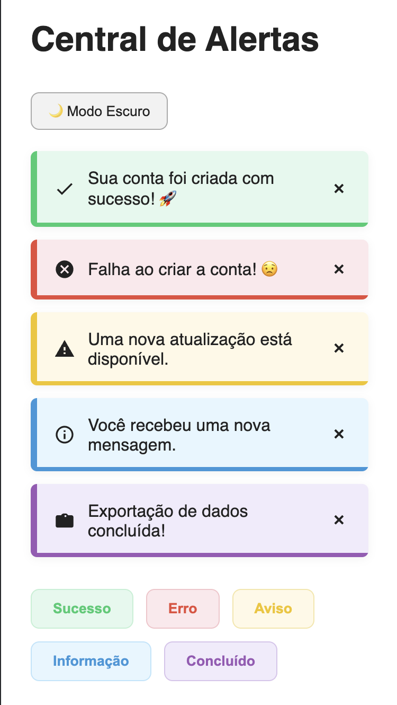

# 🔔 GlowAlerts

## 📌 Sobre o Projeto  
Sistema moderno de alertas interativos com ícones SVG animados, modo escuro e design responsivo.  
<br>
Criado com HTML, CSS e JavaScript puros, o projeto exibe mensagens visuais de sucesso, erro, aviso, informação e conclusão com estilos distintos, animações suaves e usabilidade clara.

<br>

## 🎯 Objetivos

- Exibir alertas personalizados com visual limpo e moderno.
- Utilizar SVGs inline para representar cada tipo de alerta sem bibliotecas externas.
- Permitir alternância entre modo claro e escuro com apenas um clique.
- Garantir responsividade e usabilidade fluida em qualquer dispositivo.
- Manter o projeto leve, performático e 100% Vanilla JS.

<br>

## 🧩 Funcionalidades

- 5 tipos de alertas: Sucesso, Erro, Aviso, Informação e Conclusão.
- Ícones SVG inline com herança automática de cor por tema.
- Linha de animação inferior que destaca o alerta ao surgir.
- Botão de fechar para cada alerta.
- Modo escuro com alternância suave.
- Botões de disparo visualmente estilizados com foco em acessibilidade.
- Código modular e de fácil manutenção.
- Sem dependências externas.

<br>

## 🔍 Exemplos Visuais

Exemplo dos Alertas Ativos:
<br>

<p align="left">
  
  
</p>

<br>

## 📁 Estrutura do Projeto

```
glow-alerts/
├── index.html         # Estrutura principal da interface
├── styles.css         # Estilos visuais, temas e responsividade
├── script.js          # Lógica dos alertas, SVGs e dark mode
├── images/            # Screenshots para o README
└── README.md          # Documentação do projeto
```

<br>

## 🚀 Como Usar

1. Clone o repositório:

```bash
git clone https://github.com/https-almeidasito/glow-alerts.git
```

2. Abra o arquivo `index.html` no navegador.

3. Clique nos botões: Sucesso, Erro, Aviso, Informação ou Concluído para disparar alertas visuais.

4. Utilize o botão “🌙 Modo Escuro” para alternar instantaneamente entre os temas claro e escuro.

<br>

## 🎨 Personalização

- **SVGs personalizados** podem ser ajustados dentro da função `getIcon()` em `script.js`.
- Cores, temas, fontes e espaçamentos estão definidos no `styles.css` com `:root` para fácil modificação.
- Para criar novos tipos de alerta, basta adicionar novas opções à função `getIcon()` e estilizá-las no CSS.

<br>

## 👩‍💻 Sobre a Autora

Feito com 💜 por **Giovana Nunes Schumacher** — desenvolvedora web e entusiasta de interfaces funcionais, limpas e acessíveis.

<br>

## 📬 Contato

- GitHub: [github.com/gischumacher3](https://github.com/gischumacher3)  
- LinkedIn: [linkedin.com/in/giovana-schumacher](https://linkedin.com/in/giovana-schumacher)
