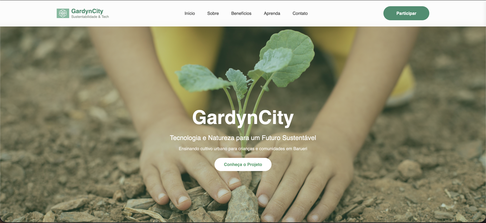

# 🌱 GardynCity — Projeto Social (Website)

## 📌 Sobre o Desenvolvimento

Este projeto consiste no desenvolvimento de um **site institucional** para o projeto social **GardynCity**, criado com o objetivo de apresentar a iniciativa, seus valores e impacto social de forma clara, acessível e visualmente agradável.

O site foi desenvolvido com foco em **responsividade**, **organização das informações** e **experiência do usuário**, destacando a identidade do GardynCity e sua proposta de unir tecnologia, sustentabilidade e agricultura urbana.

 

## 🎯 Objetivos do Projeto

- Desenvolver um site institucional para um projeto social.  
- Apresentar informações do GardynCity de forma clara e objetiva.  
- Criar um layout moderno e responsivo para diferentes dispositivos.  
- Aplicar boas práticas de HTML, CSS e estruturação visual.  
- Tornar o conteúdo acessível para crianças, jovens e comunidade em geral.

 

## 🧩 Estrutura do Site

O site foi organizado em seções para facilitar a navegação e compreensão do conteúdo:

- **Home**  
  Apresentação visual do projeto e introdução à proposta do GardynCity.

- **Sobre**  
  Contexto, origem e propósito do projeto social.

- **Atuação / Impacto**  
  Explicação das áreas trabalhadas, como tecnologia sustentável e cultivo urbano.

- **Contato**  
  Informações para comunicação e aproximação com a comunidade.

 

## 🛠️ Tecnologias Utilizadas

- **HTML5** – Estrutura do site  
- **CSS3** – Estilização e layout  
- **Bootstrap** – Responsividade e organização em grid  
- **Git & GitHub** – Versionamento do código  

 

## 🔍 Exemplos Visuais

  

  
  

  
 

 

## 📁 Estrutura do Projeto

gardyncity-site

- index.html        # Estrutura principal da página  
- css/style.css     # Estilos personalizados  
- assets/           # Imagens, ícones e recursos visuais  
- README.md         # Documentação do projeto  

 

## 🚀 Como Executar o Projeto

1. Clone o repositório:

2. Abra o arquivo `index.html` no navegador.

3. Navegue pelas seções do site.

 

## 🎨 Decisões de Design

- Layout simples e intuitivo para facilitar o acesso da comunidade.  
- Uso de cores relacionadas à **natureza e sustentabilidade**.  
- Tipografia legível e agradável para diferentes faixas etárias.  
- Estrutura pensada para fácil manutenção e expansão futura.

 

## 👩‍💻 Desenvolvimento

Projeto desenvolvido por **Giovana Nunes Schumacher**, com foco em impacto social, aprendizado prático e aplicação de conhecimentos em desenvolvimento web e design responsivo.

 

## 📬 Observações Finais

Este projeto pode ser expandido futuramente com:
- Integração de formulários funcionais  
- Conteúdos dinâmicos  
- Área administrativa ou painel de gestão  
- Acessibilidade aprimorada

