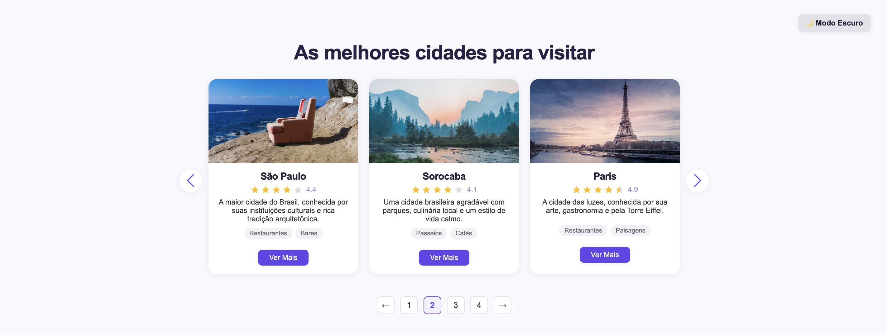
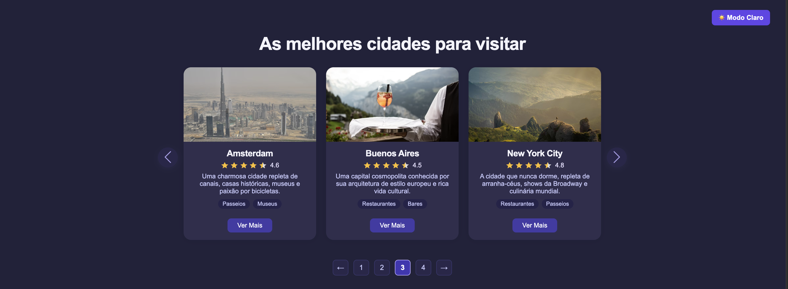

# 🌍 Top Cities To Visit

## 📌 Sobre o Projeto  
Componente visual e funcional para exibição de cidades recomendadas para viagem.  
<br>
Design moderno, responsivo e interativo, perfeito para blogs, portais de conteúdo, agências de turismo ou qualquer página que queira destacar destinos.  
<br>
Cards animados, tags customizadas, sistema de reviews e paginação estilizada, tudo pensado para oferecer uma experiência atrativa, prática e facilmente integrável em qualquer site.

<br>

## 🎯 Objetivos

- Apresentar cidades de forma visualmente organizada e atraente.
- Possibilitar customização fácil de textos e tags.
- Garantir responsividade para todos os dispositivos e layouts.
- Entregar um componente 100% em HTML, CSS e JS puro, sem frameworks.
- Facilitar futuras integrações (modais, links detalhados etc).

<br>

## 🧩 Funcionalidades

- Cards centralizados, responsivos e com animação de entrada.
- Paginação intuitiva com setas externas e botões numerados.
- Tags de categoria por cidade, facilmente customizáveis.
- Sistema de avaliação por estrelas.
- Botão “Ver Mais” pronto para expansão de funcionalidades.
- Estrutura flexível e pronta para integração em diferentes páginas.

<br>

## 🔍 Exemplo Visual

Exemplo do componente em uso:
<br>

<p align="left">
  
</p>
<p align="left">
  
</p>

<br>

## 📁 Estrutura do Projeto

```
top-cities/
├── index.html         # Estrutura principal do componente
├── style.css          # Estilização moderna e responsiva
├── script.js          # Lógica de navegação, reviews e interações
├── examples/
│    └── component-example.png
└── README.md
```

<br>

## 🚀 Como Usar

1. Clone o repositório ou baixe os arquivos do projeto:

   ```bash
   git clone https://github.com/seu-usuario/top-cities.git
   ```

2. Abra o arquivo `index.html` no navegador para visualizar e testar o componente.

3. Personalize a lista de cidades, descrições e tags diretamente no `script.js`.

4. Expanda a integração do botão “Ver Mais” conforme a necessidade do seu site (página interna, modal etc).

<br>

## 🎨 Personalização

- **Cores, fontes e animações** podem ser alteradas no `style.css` para se adequar à identidade visual do seu projeto.
- Os **textos e categorias** são configurados no `script.js`.
- O layout é modular e pode ser adaptado no `index.html` sem perder a responsividade.

<br>

## 👩‍💻 Sobre o Autor(a)


Feito com 💜 por **Giovana Nunes Schumacher** — desenvolvedora web e entusiasta de interfaces funcionais, limpas e acessíveis.

<br>

## 📬 Contato

- GitHub: [github.com/gischumacher3](https://github.com/gischumacher3)  
- LinkedIn: [linkedin.com/in/giovana-schumacher](https://linkedin.com/in/giovana-schumacher)
