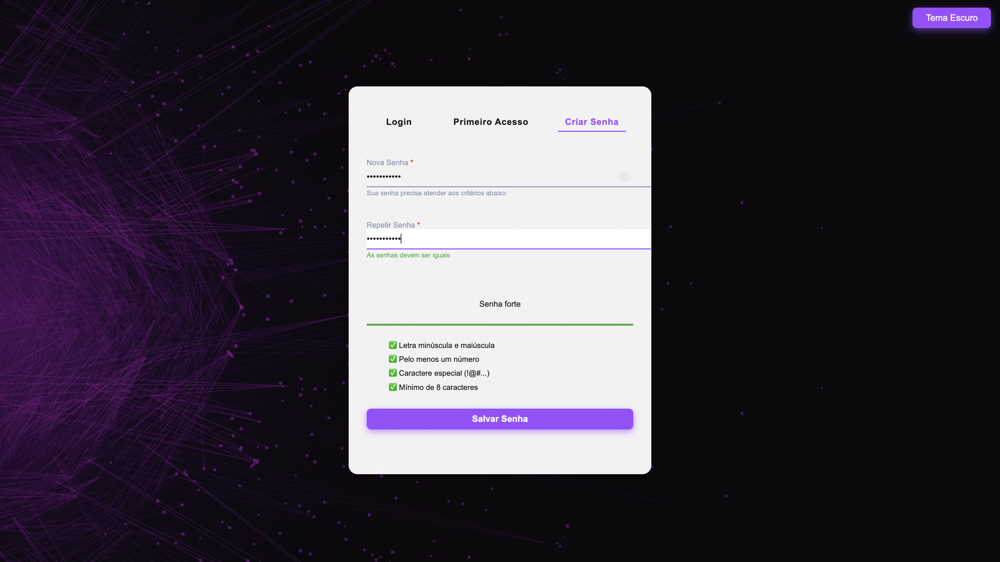
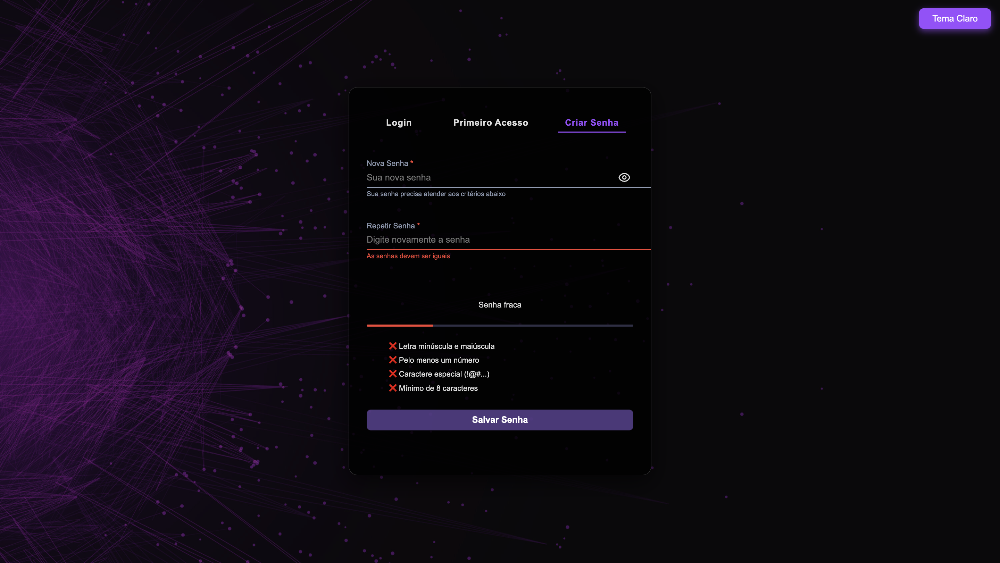

# 🔐 Interface de Autenticação com Validação e Tema Dinâmico

## 📌 Sobre o Projeto  
Interface moderna e funcional de autenticação com **abas organizadas** para login, cadastro e criação de senha.

O projeto traz **validações em tempo real**, feedbacks visuais, alternância de tema claro/escuro, verificação de força da senha e uma experiência fluida, intuitiva e responsiva para o usuário.

Ideal para projetos que necessitam de uma base front-end sólida para autenticação de usuários.

<br>

## 🎯 Objetivos  

- Oferecer uma interface de autenticação com múltiplas funcionalidades integradas.  
- Permitir **validação imediata** de campos e verificação de senha segura.  
- Garantir **modo escuro e claro** com alternância suave.  
- Proporcionar uma **experiência de usuário moderna**, acessível e responsiva.  
- Criado 100% com **HTML, CSS e JavaScript puros**, sem dependências externas.

<br>

## 🧩 Funcionalidades  

- Abas para **Login**, **Cadastro** e **Criação de Senha**  
- **Validação em tempo real** de e-mail, nome e senhas  
- Indicador de **força da senha** com critérios visuais e barra de progresso  
- Alternância entre **tema claro e escuro** com um clique  
- Ícone de **mostrar/ocultar senha** integrado ao campo  
- Mensagens de validação com **cores, ícones e bordas**  
- Layout responsivo com design **glassmorphism**  
- Campos com **estados visuais (válido/inválido)** bem definidos  

<br>

## 📸 Exemplos Visuais  
<br>

<p align="left">
  
  
</p>

<br>

## 📁 Estrutura do Projeto

```
auth-interface/
├── index.html         # Estrutura principal da interface
├── style.css          # Estilização completa e suporte a temas
├── script.js          # Lógica de abas, validação e interações
├── assets/
│   └── Fundo.jpg      # Imagem de fundo usada na interface
├── README.md          # Documentação do projeto
```

<br>

## 🚀 Como Usar  

1. Clone o repositório:  
```
git clone https://github.com/gischumacher3/auth-interface.git
```

2. Acesse o projeto:
```
cd auth-interface
```

3. Abra o arquivo `index.html` no seu navegador e utilize normalmente.

<br>

## 🎨 Personalização  

- Cores, fontes, sombras e temas estão configuradas via **CSS custom properties** no `style.css`.  
- A lógica de validação, alternância de abas e modo escuro está no `script.js`.  
- A estrutura visual e campos podem ser alterados diretamente no `index.html`.

<br>

## 👩‍💻 Sobre a Autora  

Feito com 💜 por **Giovana Nunes Schumacher** — desenvolvedora web apaixonada por interfaces modernas, acessíveis e funcionais.

<br>

## 📬 Contato  

- GitHub: [github.com/gischumacher3](https://github.com/gischumacher3)  
- LinkedIn: [linkedin.com/in/giovana-schumacher](https://linkedin.com/in/giovana-schumacher)
