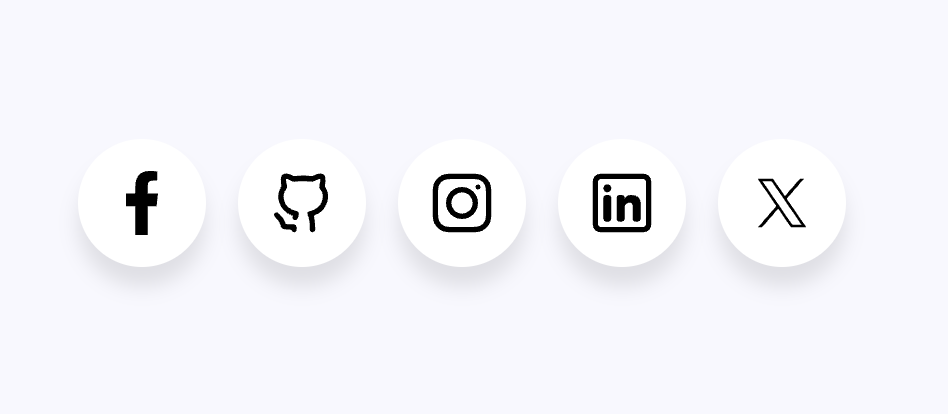
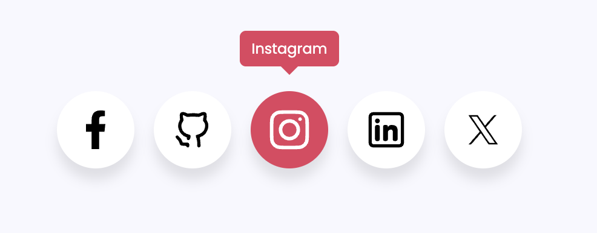

# ✨ Projeto: Ícones de Mídia Social com Hover

 

## 📌 O que é o Projeto

Este projeto consiste em uma interface limpa e responsiva que exibe ícones de mídias sociais com efeitos de *hover interativo* e *tooltip personalizada*, ideal para portfólios, landing pages ou aplicações web modernas.

 

## 🎯 Objetivo do Projeto

Criar um componente visual elegante que:
 
 •⁠  ⁠Centralize os principais ícones sociais em um layout uniforme.
 •⁠  ⁠Destaque o ícone com efeito ao passar o mouse (hover).
 •⁠  ⁠Exiba o nome da rede social em uma tooltip.
 •⁠  ⁠Sirva como base para reuso em projetos web diversos.

 

## 💬 Linguagens do Projeto

 •⁠  ⁠⁠ HTML5 ⁠
 •⁠  ⁠⁠ CSS3 ⁠

 

## 🔍 Exemplos Visuais

  

  

  

 

## 🛠️ Tecnologias Utilizadas
 •⁠  ⁠*HTML5* – Estrutura dos elementos da página
 •⁠  ⁠*CSS3* – Estilização, animações e responsividade
 •⁠  ⁠*Font Google* e *SVGs personalizados* – Ícones sociais
 •⁠  ⁠*Tooltip customizada em CSS*

 

## 🚀 Funcionalidades

Ícones para as principais redes sociais:
  - Facebook
  - GitHub
  - Instagram
  - LinkedIn
  - X (antigo Twitter)
•⁠  ⁠Efeito ⁠ hover ⁠ com:
  - Mudança de fundo
  - Tooltip com nome da rede social
  - Destaque no ícone selecionado
  - Design centralizado, moderno e responsivo

 

## 📁 Estrutura dos Arquivos

Project-Social-Media-Icons/ >
index.html >
style.css >
example/ >
Social-Buttons-Ui.png >
Social-Buttons-Facebook.png >
assets/ >
facebook.png >
README.md

 

*Sinta-se à vontade para clonar, customizar ou contribuir!*
 
*Feito com 💜 por [gischumacher3](https://github.com/gischumacher3)*
